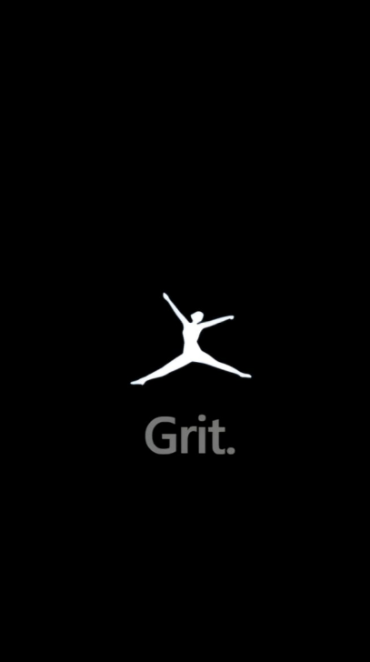

<p align="center">
  
</p>

# 🏋️ Grit - One-stop for Fitness

## 🌟 Overview

**Grit** is a comprehensive, AI-powered fitness companion designed to help you achieve your health and wellness goals. Whether you're a beginner or an elite athlete, Grit provides the tools, guidance, and motivation needed to push your limits.

Build with **React Native (Expo)** and powered by **Supabase**, Grit offers a seamless, cross-platform experience with a focus on performance, aesthetics, and personalized fitness.

---

## 🚀 Key Features

### 🤖 Grit AI Trainer
Get personalized workout advice, form corrections, and nutrition tips from our integrated AI trainer. It's like having a personal coach in your pocket 24/7.

### 📋 Workout Scheduler & Library
- Access a vast library of exercises and pre-built workout routines.
- Schedule your workouts and stay consistent with integrated reminders.
- Custom workout creation tailored to your equipment and goals.

### 📊 Progress Tracking
- Visualize your journey with detailed charts and statistics.
- Track weight, body measurements, and performance milestones.
- Integration with React Native Chart Kit for beautiful data visualization.

### 🍎 Calorie Counter & Calculator
- Calculate your TDEE and macro requirements.
- Track daily intake and stay on top of your nutrition.

### 🔒 Secure Authentication
- Robust user authentication and data management powered by **Supabase**.
- Secure storage for all your personal fitness data.

---

## 🛠️ Tech Stack

- **Frontend:** React Native (Expo)
- **Backend/Auth:** Supabase
- **Navigation:** React Navigation
- **Styling:** Vanilla CSS-in-JS (React Native StyleSheets)
- **Data Visualization:** React Native Chart Kit
- **Icons:** Expo Vector Icons (Ionicons)

---

## ⚙️ Installation & Setup

To get Grit running locally, follow these steps:

### Prerequisites
- Node.js (v18 or later)
- Expo Go app on your mobile device (or an emulator)

### Steps

1. **Clone the repository:**
   ```bash
   git clone https://github.com/sa1165/Grit-Fitness.git
   cd Grit
   ```

2. **Install dependencies:**
   ```bash
   npm install
   ```

3. **Configure Environment Variables:**
   Create a `.env` file in the root directory and add your Supabase credentials.

4. **Start the development server:**
   ```bash
   npx expo start
   ```

5. **Run on your device:**
   Scan the QR code with the Expo Go app.

---

## 🎨 UI & UX
Grit features a modern, dark-themed UI designed for focus and ease of use during workouts. With sleek gradients and micro-animations, the experience is both premium and intuitive.

---

## 📄 License
This project is licensed under the MIT License - see the [LICENSE](LICENSE) file for details.

---

## ✨ Contributors
Developed with ❤️ by the Grit Team.
