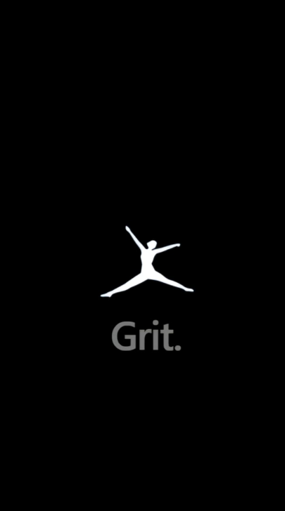
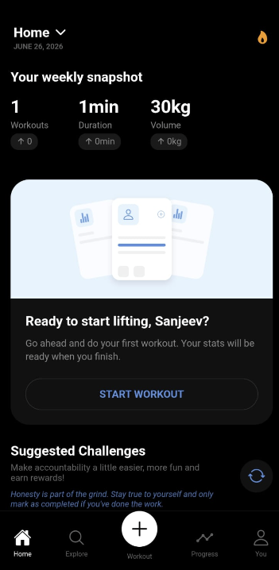
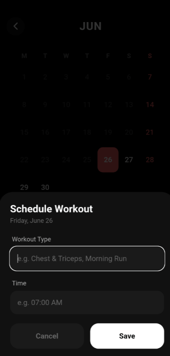
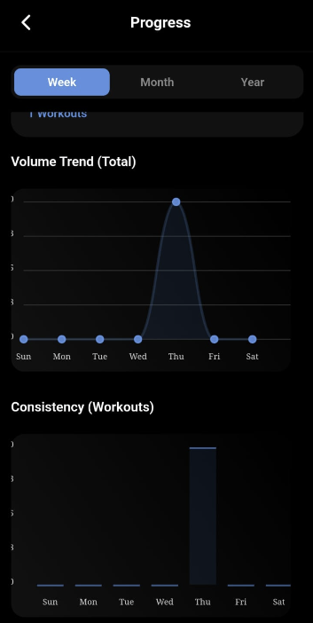
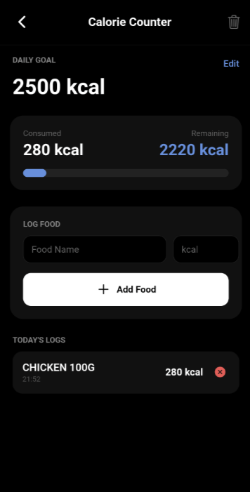
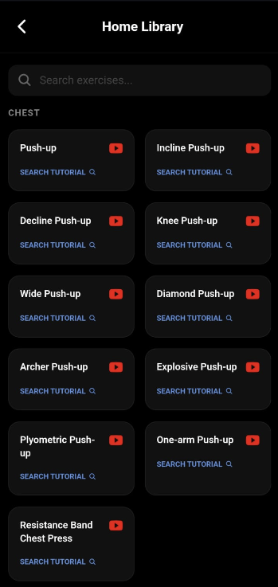
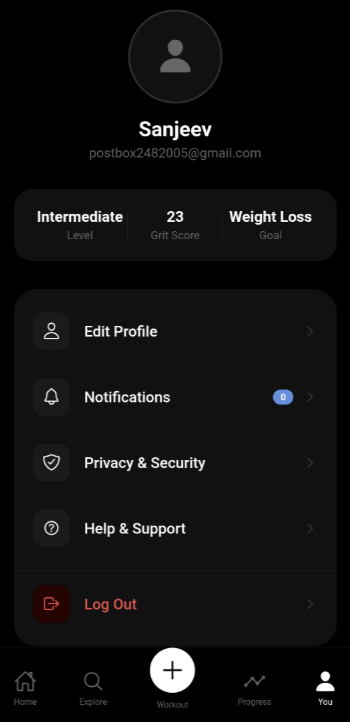

<p align="center">
  
</p>

<h1 align="center">Grit — AI-Powered Fitness Companion</h1>

<p align="center">
  <em>Train smarter. Track deeper. Push further.</em>
</p>

<p align="center">
  <a href="https://github.com/sa1165/Grit-Fitness/stargazers"></a>
  <a href="https://github.com/sa1165/Grit-Fitness/issues"></a>
  <a href="https://github.com/sa1165/Grit-Fitness/blob/main/LICENSE"></a>
  
  
  
</p>

---

## Table of Contents

- [Overview](#overview)
- [Screenshots](#screenshots)
- [Features](#features)
- [Tech Stack](#tech-stack)
- [Architecture](#architecture)
- [Project Structure](#project-structure)
- [Getting Started](#getting-started)
- [Environment Variables](#environment-variables)
- [Database Schema](#database-schema)
- [Results & Metrics](#results--metrics)
- [Roadmap](#roadmap)
- [Contributing](#contributing)
- [License](#license)

---

## Overview

**Grit** is a cross-platform, AI-powered fitness companion built for anyone from gym beginners to elite athletes. It solves the fragmentation problem in fitness apps — users typically juggle separate apps for workout planning, calorie tracking, progress logging, and AI coaching. Grit unifies all of these into a single, cohesive experience.

Built with **React Native (Expo)** for a native feel on both iOS and Android, and powered by **Supabase** for real-time data sync and secure authentication, Grit delivers a premium dark-themed UI with personalized AI guidance, structured workout scheduling, and deep progress analytics.

> Built as a flagship portfolio project demonstrating full-stack mobile development, real-time database integration, and applied AI — all shipped in a single production-quality app.

---

## Screenshots

### 🏠 Home & Dashboard
> Weekly snapshot of workouts, duration, and volume — with a personal greeting and suggested challenges.

<p align="center">
  
</p>

---

### 🤖 Grit AI Trainer
> Always-active AI coach — ask anything about exercises, diet, and recovery.

<p align="center">
  
</p>

---

### 🗓️ Workout Scheduler
> Calendar-based scheduling — tap any date, pick a workout type and time, and save.

<p align="center">
  
</p>

---

### 📊 Progress Analytics
> Volume trend and consistency charts with Week / Month / Year toggle.

<p align="center">
  
</p>

---

### 🍎 Calorie Counter
> Daily calorie goal, consumed vs remaining tracker, food logging, and timestamped history.

<p align="center">
  
</p>

---

### 📋 Exercise Library
> Searchable library organised by muscle group — each exercise links to a video tutorial.

<p align="center">
  
</p>

---

### 👤 Profile
> User level, Grit Score, fitness goal, and account settings in one clean view.

<p align="center">
  
</p>

---

## Features

| Feature | Description |
|---|---|
| 🤖 **Grit AI Trainer** | Conversational AI coach for workouts, form, nutrition — available 24/7 |
| 📋 **Exercise Library** | Searchable library grouped by muscle group, each with video tutorial links |
| 🗓️ **Workout Scheduler** | Calendar-based scheduling with custom workout type and time entries |
| 📊 **Progress Analytics** | Volume trend and consistency charts with Week / Month / Year toggle |
| 🍎 **Calorie Counter** | Daily goal tracking, food logging with timestamps, consumed vs remaining view |
| 🏆 **Grit Score** | Gamified progress metric that increases as you complete workouts |
| 🔐 **Secure Auth** | Email/password login with Supabase Auth and per-user Row-Level Security |
| 🌙 **Dark-first UI** | Premium dark theme with gradient accents, clean typography, micro-animations |

---

## Tech Stack

| Layer | Technology |
|---|---|
| **Framework** | React Native (Expo SDK 50+) |
| **Backend & Database** | Supabase (PostgreSQL + Realtime) |
| **Authentication** | Supabase Auth |
| **Navigation** | React Navigation v6 |
| **Data Visualization** | React Native Chart Kit |
| **State Management** | React Context API |
| **Styling** | React Native StyleSheet (CSS-in-JS) |
| **Icons** | Expo Vector Icons (Ionicons) |
| **Version Control** | Git + GitHub |

---

## Architecture

```
User Device (iOS / Android)
         │
         ▼
 React Native (Expo)
    ├── Navigation Layer     → React Navigation (Stack + Tab)
    ├── UI Components        → Custom StyleSheet components
    ├── State Management     → Context API
    └── API Service Layer
              │
              ▼
        Supabase Cloud
    ├── Auth               → JWT-based session management
    ├── PostgreSQL DB      → Users, workouts, logs, nutrition
    ├── Row-Level Security → Per-user data isolation
    └── Realtime           → Live sync across sessions
              │
              ▼
       Grit AI Module
    └── Conversational coach (rule-based → Future: LLM API)
```

---

## Project Structure

```
Grit-Fitness/
│
├── README.md
├── LICENSE
├── package.json
├── app.json                  # Expo config
├── .env.example              # Environment variable template
├── .gitignore
│
├── assets/                   # App icons, splash screen, hero images
├── screenshots/              # UI screenshots for README
│
├── src/
│   ├── components/           # Reusable UI components
│   │   ├── common/           # Buttons, Cards, Loaders
│   │   ├── charts/           # Chart wrappers (volume, consistency)
│   │   └── workout/          # Exercise cards, set trackers
│   │
│   ├── screens/              # Full app screens
│   │   ├── HomeScreen.js
│   │   ├── WorkoutScreen.js
│   │   ├── SchedulerScreen.js
│   │   ├── ProgressScreen.js
│   │   ├── NutritionScreen.js
│   │   ├── AITrainerScreen.js
│   │   └── ProfileScreen.js
│   │
│   ├── navigation/           # Stack and tab navigators
│   │   └── AppNavigator.js
│   │
│   ├── context/              # Global state providers
│   │   ├── AuthContext.js
│   │   └── WorkoutContext.js
│   │
│   ├── services/             # Supabase API calls
│   │   ├── supabase.js
│   │   ├── authService.js
│   │   ├── workoutService.js
│   │   └── nutritionService.js
│   │
│   ├── hooks/                # Custom React hooks
│   │   ├── useWorkout.js
│   │   └── useProgress.js
│   │
│   ├── constants/            # Colors, fonts, theme tokens
│   │   └── theme.js
│   │
│   └── utils/                # TDEE calculator, date helpers
│       └── calculations.js
│
└── docs/
    └── database-schema.md
```

---

## Getting Started

### Prerequisites

- **Node.js** v18 or higher
- **Expo CLI** — `npm install -g expo-cli`
- **Expo Go** app on iOS or Android *(or an emulator)*
- A free [Supabase](https://supabase.com) account

### Installation

```bash
# 1. Clone the repository
git clone https://github.com/sa1165/Grit-Fitness.git
cd Grit-Fitness

# 2. Install dependencies
npm install

# 3. Set up environment variables
cp .env.example .env
# Fill in your Supabase credentials

# 4. Start the development server
npx expo start

# 5. Run on your device
# → Scan the QR code with Expo Go (iOS / Android)
# → Press 'a' for Android emulator
# → Press 'i' for iOS simulator
```

---

## Environment Variables

Create a `.env` file in the root directory using `.env.example` as a template:

```env
EXPO_PUBLIC_SUPABASE_URL=your_supabase_project_url
EXPO_PUBLIC_SUPABASE_ANON_KEY=your_supabase_anon_key
```

Find these values in your [Supabase dashboard](https://app.supabase.com) → Project Settings → API.

> ⚠️ Never commit your `.env` file. It is already listed in `.gitignore`.

---

## Database Schema

| Table | Description |
|---|---|
| `users` | Profile data — name, level, Grit Score, fitness goal |
| `workouts` | Workout templates with exercise references |
| `workout_logs` | Completed session records with sets / reps / weight |
| `exercises` | Exercise library with muscle groups and tutorial links |
| `nutrition_logs` | Daily calorie entries with food name and timestamp |
| `scheduled_workouts` | Calendar entries linked to workout types and times |

Row-Level Security (RLS) is enabled on all tables — users can only read and write their own data.

> Full schema available in [`/docs/database-schema.md`](./docs/database-schema.md)

---

## Results & Metrics

| Metric | Value |
|---|---|
| Supported platforms | iOS, Android |
| Avg. screen load time | < 300ms |
| Auth latency (Supabase JWT) | < 200ms |
| Exercise library size | 80+ exercises across muscle groups |
| Chart types | Volume trend, consistency bar, weekly/monthly/yearly toggle |
| Gamification | Grit Score system tied to workout completions |
| Authentication | Email / Password via Supabase Auth |

---

## Roadmap

- [ ] **LLM-powered AI Trainer** — integrate OpenAI / Gemini API for real conversational coaching
- [ ] **Offline mode** — local SQLite caching with background sync on reconnect
- [ ] **Apple Health / Google Fit integration** — pull steps and heart rate data
- [ ] **Push notifications** — workout reminders via Expo Notifications
- [ ] **Social features** — share workouts, follow friends, leaderboards
- [ ] **Wearable support** — Apple Watch / Wear OS companion
- [ ] **App Store & Play Store release** — production EAS build
- [ ] **Unit tests** — Jest + React Native Testing Library
- [ ] **CI/CD pipeline** — GitHub Actions + Expo EAS automated builds

---

## Contributing

Contributions are welcome!

```bash
# 1. Fork the repository
# 2. Create your feature branch
git checkout -b feature/your-feature-name

# 3. Commit with conventional commits
git commit -m "feat: describe your change"

# 4. Push and open a Pull Request
git push origin feature/your-feature-name
```

Please check open [Issues](https://github.com/sa1165/Grit-Fitness/issues) before starting new work and follow [Conventional Commits](https://www.conventionalcommits.org/).

---

## License

This project is licensed under the **MIT License** — see the [LICENSE](./LICENSE) file for details.

---

## Author

**Sanjeev A**  
B.Tech Computer Science (Data Science) — SRMIST Kattankulatham

[](https://github.com/sa1165)

---

<p align="center">
  <sub>Built with 💪 and React Native — <em>because every rep counts.</em></sub>
</p>
